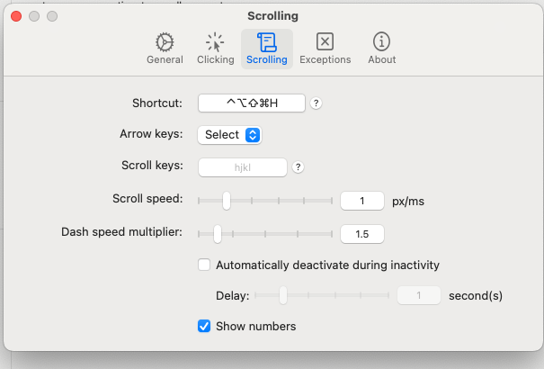
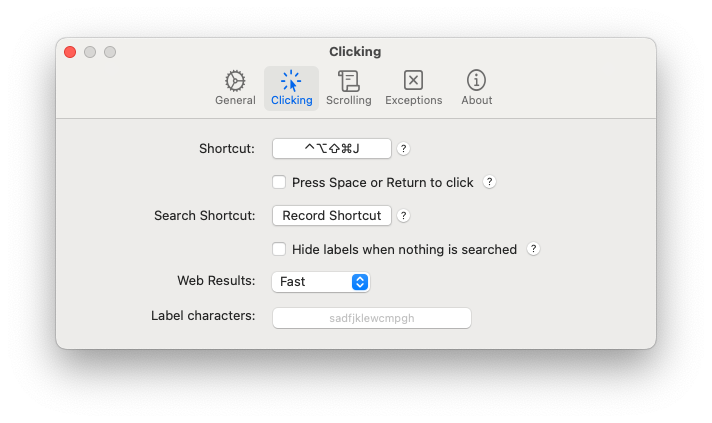

## Homerow

Current shortcuts, confirmed by you and live preferences on 2026-09-26:

- **Hyper + H**: show clickable hints; type a hint to click app controls.
- **Hyper + J**: start keyboard scrolling; arrow-key scrolling is enabled.
- **Hyper = Right Option**, mapped to Control + Option + Shift + Command by Raycast.

Install/restore from [Homerow](https://www.homerow.app/). Follow the current app's
permission prompts. The screenshots below are historical references; use the
verified mappings above if an old image differs.

